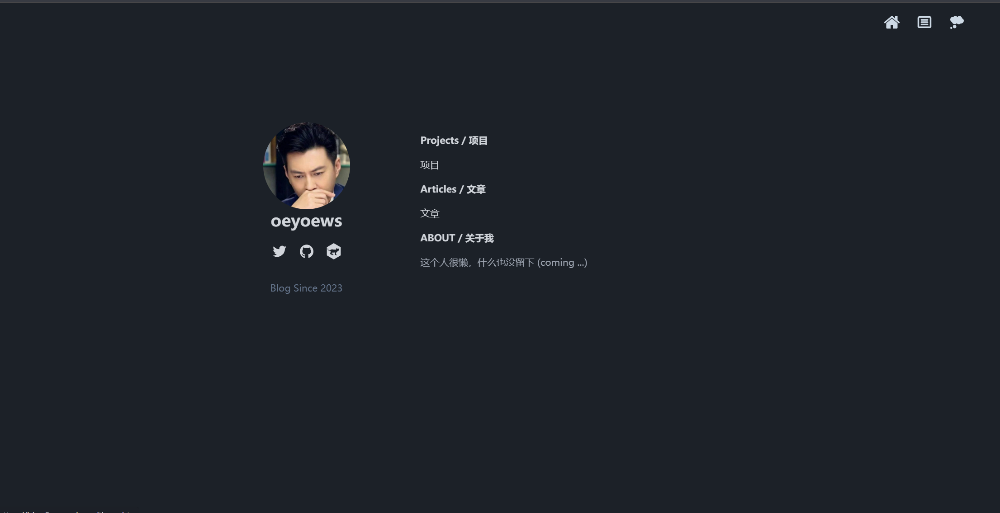

## 个人博客

* React 版本：https://github.com/oeyoews/oeyoews.me
* Vue 版本：https://github.com/oeyoews/oeyoews-nuxt3-blog.me

## 特性

* [x] 支持本地 markdown 文件
* [x] 支持使用 GitHub issue API
<!-- * [x] 支持 json 数据源 -->

## 在线预览

https://blog2s.vercel.app

> [!NOTE]
> 在线地址国内访问不稳定

<!-- ## 问题

* layout, route 不支持热加载
* use chinese title
* 使用 nuxtpage 共享页面

## Links

* https://www.youtube.com/watch?v=wW1gePu3Wl8

## TODO

* 中文路由
* toc
* 嵌套路由
* 传参
* xxx.post
* loadmore
* use degit to get content
* usehead xx  | xxx
* issue comment body
* 重复代码组件封装 -->